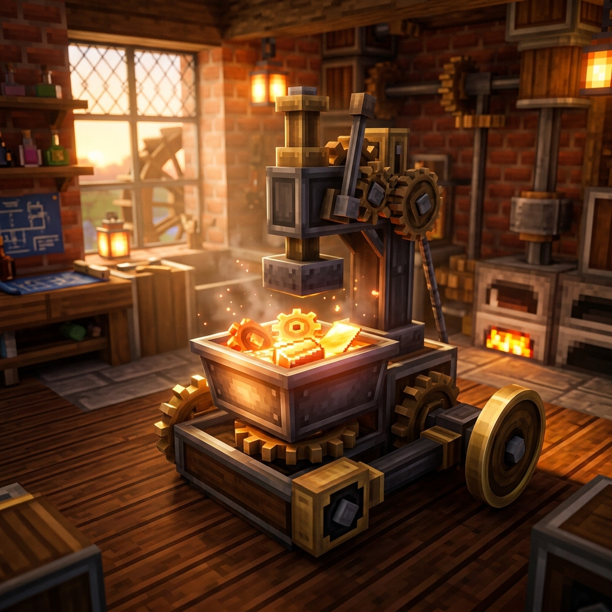

# Create Recipe Priority

### Solving Automation Frustrations in Large Modpacks!

In **large modpacks**, automated compacting and shapeless crafting inside Create's Basin (Pressing and Mixing) can quickly become a frustrating mess of recipe overlaps. 

By default, Create sorts matching Basin recipes solely by the **total number of ingredients** in descending order. When automating crafting processes or mixing complex recipes in content-heavy modpacks, this default behavior introduces frustrating bottlenecks:
- **Unwanted Compacting:** A **3x3** (9-ingredient) or **2x2** (4-ingredient) packing recipe will almost always take precedence over standard mixing recipes (such as a 3-ingredient Blaze Cake Base). If excess ingredients enter the Basin during automated processing, the machine prematurely compresses them into blocks or items (like Sugar Cubes) instead of your intended craft!
- **Shapeless Overlaps:** Automated shapeless crafting often collides with custom processing lines, breaking automated production loops and clogging factory inputs.

---

### How It Works: The 4-Tier Priority System

**Create Recipe Priority** is a lightweight, out-of-the-box NeoForge addon that intercepts Create’s Basin recipe matching logic. It enforces an intelligent **4-Tier Hierarchy**, ensuring your automation works exactly as intended without complex filtering setups:

1. **Dedicated Basin Recipes (Highest Priority):** Explicit Create recipes will **always** execute first whenever valid ingredients are present.
2. **Automated Shapeless Crafting:** Standard shapeless crafting recipes utilizing distinct items take second priority, enabling clean and uninterrupted automation.
3. **3x3 Packing:** Standard block packing recipes requiring 9 identical items.
4. **2x2 Packing (Lowest Priority):** Small compacting recipes requiring 4 of the same item.

---

### Features & Compatibility

- **Plug & Play:** Requires zero config, scripts, or datapacks. Simply drop it into your mods folder!
- **Modpack Friendly:** Essential for modpack creators looking to streamline quality-of-life automation across dozens of overlapping mod recipes.
